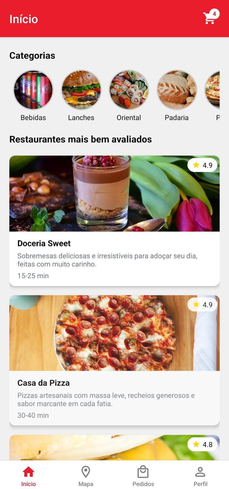
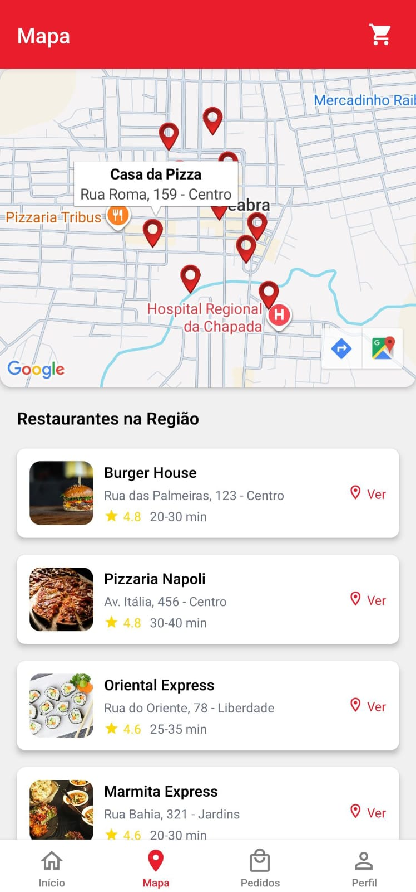
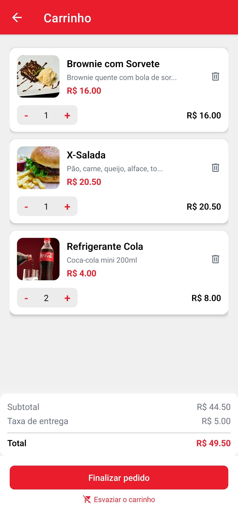

# 🍔 InfnetFood

Um aplicativo mobile de delivery de comida com **React Native** e **Expo**.

## - Preview do App

<p align="center">
  
  
  
</p>

## - Sobre

O InfnetFood é um projeto educacional solicitado como requisito avaliativo da matéria de Desenvolvimento Mobile com React Native, ministrada pelo docente Cidcley Schmitt, que implementa uma plataforma de entregas com login, catálogo de produtos, carrinho de compras, checkout e histórico de pedidos.

## - Funcionalidades

- Autenticação com persistência
- Página inicial com categorias e restaurantes
- Carrinho de compras com cálculo automático
- Checkout com validação
- Histórico de pedidos
- Mapa com 10 restaurantes
- Perfil do usuário
- Tema claro/escuro
- Notificações de status

## - Tecnologias

- React Native 0.81.5
- Expo 54.0.33
- React Navigation
- Styled Components
- AsyncStorage
- Expo Notifications
- Foodish API
- React Leaflet

## - Como Executar

### Pré-requisitos

- Node.js
- Expo CLI: `npm install -g expo-cli`

### Instalação

```bash
git clone <seu-repositorio>
cd infnetfood
npm install
npm start
```

### Plataformas

```bash
npm run android    # Android
npm run ios        # iOS
npm run web        # Web
```

### Com Expo Go

1. Baixe o app **Expo Go** no celular
2. Abra o link (https://snack.expo.dev/@queziagc/infnetfood) ou escaneie o código QR gerado em um computador

## - Login de Teste

```
E-mail: joao@gmail.com
Senha: 123
```

## - Estrutura

```
src/
├── components/       # Componentes reutilizáveis
├── screens/         # Telas principais
├── context/         # Context API
├── navigation/      # Rotas
├── data/           # Dados mockados
├── services/       # Serviços
└── theme/          # Design dos temas
```

## - Conceitos Implementados

- Componentes funcionais com Hooks
- Context API para estado global
- React Navigation
- AsyncStorage para persistência
- Fetch API
- Styled Components
- Tema dinâmico

## - Referências

- [React Native](https://reactnative.dev/docs/components-and-apis)
- [Expo](https://docs.expo.dev)
- [React Navigation](https://reactnavigation.org)
- [Foodish API](https://github.com/surhud004/Foodish#readme)
- [Expo Notifications](https://docs.expo.dev/versions/latest/sdk/notifications/)
- [react-native-toast-message](https://www.npmjs.com/package/react-native-toast-message)
- [react-leaflet](https://react-leaflet.js.org/)

## ⚠️ Aviso sobre imagens

As imagens utilizadas neste projeto não são de autoria própria e foram obtidas gratuitamente na web por meio de serviços como Pexels e Foodish API, sendo utilizadas apenas para fins educacionais!